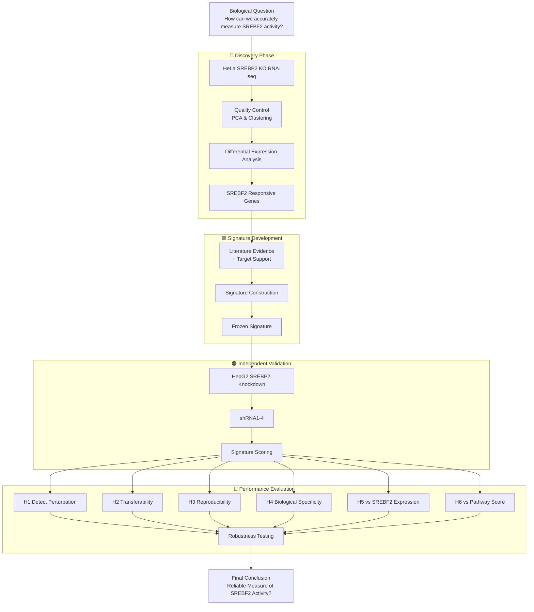

# 🧬 SREBF2-Signature

### Development and Independent Validation of an SREBF2 Transcriptional Signature

A reproducible framework for measuring functional SREBF2 activity across experimental systems.

🔵 Discovery
   └─ HeLa SREBP2 KO RNA-seq

🟢 Signature Development
   └─ Differential Expression
   └─ Target Prioritization
   └─ Signature Construction

🟠 Validation
   └─ HepG2 SREBP2 Knockdown
   └─ Multiple shRNAs

🔴 Evaluation
   └─ Transferability
   └─ Reproducibility
   └─ Benchmarking

```mermaid
flowchart TD

A[Project Initialization] --> B[Download GRCh38 Genome]
B --> C[Download GENCODE v47 Annotation]

C --> D[Reference Integrity Checks]
D --> E[Genome Annotation Compatibility QC]

E --> F[Build HISAT2 Index]
F --> G[Index Validation]

G --> H[Pilot Sample Alignment<br>SRR28966297]
H --> I[Alignment QC<br>97.67% Mapping]

I --> J[Strandness Testing]
J --> K[Unstranded Library Confirmed]

K --> L[Pilot Gene Counting]
L --> M[Count Validation]

M --> N[SRR28966285 Processing]
N --> O[Alignment QC<br>97.82% Mapping]

O --> P[Gene Counting]
P --> Q[Count Validation]

Q --> R[Generate Processing Queue]

R --> S[Process Remaining 10 Samples]

S --> T[Combine Count Tables]

T --> U[DESeq2 Differential Expression]

U --> V[SREBF2 Signature Development]

V --> W[External Validation Dataset]

W --> X[Transferability Testing]

X --> Y[Benchmarking]

Y --> Z[Publication Figures & Thesis]

classDef completed fill:#16a34a,color:#fff,stroke:#15803d
classDef current fill:#f59e0b,color:#fff,stroke:#d97706
classDef future fill:#3b82f6,color:#fff,stroke:#2563eb

class A,B,C,D,E,F,G,H,I,J,K,L,M,N,O,P,Q,R completed
class S current
class T,U,V,W,X,Y,Z future
```

# Background

Cellular cholesterol homeostasis is essential for membrane integrity, signal transduction, steroid synthesis, and overall metabolic health. One of the most important regulators of this process is SREBF2 (Sterol Regulatory Element Binding Transcription Factor 2), a transcription factor that controls the expression of numerous genes involved in cholesterol biosynthesis and uptake.

Traditionally, researchers estimate SREBF2 activity using either:

SREBF2 gene expression levels, or
Cholesterol-homeostasis pathway enrichment scores.

However, these approaches have significant limitations. The expression level of SREBF2 does not necessarily reflect its functional activity because SREBF2 must undergo activation, processing, and nuclear translocation before regulating downstream genes. Similarly, cholesterol-pathway scores may capture broader metabolic changes that are not specifically driven by SREBF2.

As a result, measuring SREBF2 expression alone may not accurately represent the true regulatory state of the cholesterol synthesis program.

# Research Problem

A potentially more informative approach is the use of a transcriptional signature, a defined set of downstream genes whose combined expression pattern reflects the activity of a biological regulator.

Although numerous SREBF2-responsive genes have been identified, it remains unclear whether a fixed SREBF2 transcriptional signature can function reliably across independent experimental systems.

Most published signatures are developed within a single dataset and are rarely evaluated for:

reproducibility,
transferability across cell types,
biological specificity,
robustness to variation,
or comparative performance against existing approaches.

Consequently, there is insufficient evidence regarding whether an SREBF2 signature derived from one biological system can accurately measure SREBF2 activity in another.

This represents an important methodological gap because transcription-factor signatures are increasingly used as surrogate measures of regulatory activity, yet their ability to generalize beyond the discovery dataset is often unknown.

# Knowledge Gap

Currently, no systematic evaluation has established whether a biologically supported and perturbation-derived SREBF2 transcriptional signature can:

Reproducibly detect SREBF2 perturbation.
Transfer across independent cell types.
Remain robust across multiple knockdown reagents.
Provide information beyond SREBF2 expression.
Perform better than conventional cholesterol-homeostasis pathway scores.

# Proposed Solution

This study will address this gap by developing a frozen SREBF2 transcriptional signature using HeLa SREBP2 knockout RNA-sequencing data.

Genes significantly affected by SREBP2 loss will be identified through differential expression analysis and prioritized using biological evidence and published target-gene information.

The resulting signature will then be frozen prior to validation to prevent overfitting.

Independent validation will subsequently be performed using HepG2 SREBP2 knockdown datasets containing multiple shRNA perturbations.

Signature performance will be evaluated in terms of:

Detection of SREBP2 perturbation
Transferability across cell types
Reproducibility across shRNAs
Biological specificity
Benchmark performance relative to:
SREBF2 expression
Cholesterol-homeostasis pathway scores
Robustness to gene loss

# Hypothesis
Primary Hypothesis

A frozen SREBF2 transcriptional signature derived from HeLa SREBP2 knockout RNA-seq data will accurately and reproducibly detect SREBP2 perturbation in independent HepG2 knockdown datasets.

Secondary Hypotheses
The signature will transfer successfully across cell types.
The signature will show reproducible behavior across independent shRNAs.
The signature will be biologically specific to SREBF2 activity.
The signature will outperform or complement SREBF2 expression.
The signature will outperform or complement cholesterol-homeostasis pathway scores.

# SREBF2 Regulatory Signature

An 8–10-week bioinformatics project using real public SREBF2
perturbation RNA-seq and chromatin-binding data.

## Research question
Can a binding-supported, perturbation-derived transcriptional
signature capture SREBF2-associated responses more consistently
than SREBF2 RNA expression alone?

## Scope
Fully computational. Real public data supply research results.
Synthetic data may be used only for software testing.

## Current status
Planning and dataset audit. No datasets analyzed or biological
findings established.

See docs/RESEARCH_PLAN.md and docs/PROGRESS.md.
