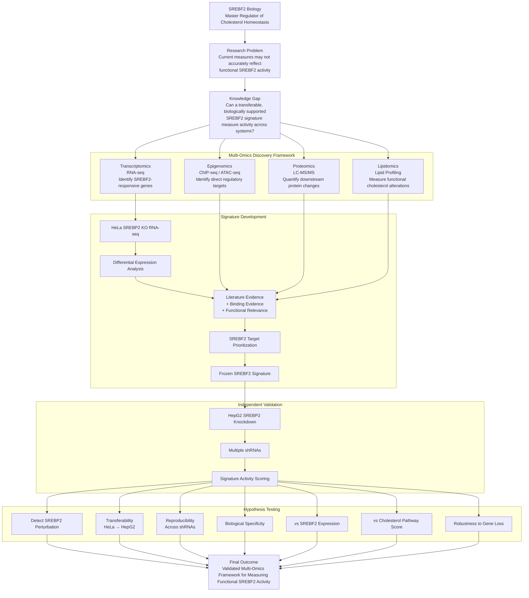

# 🧬 SREBF2-Signature

### Development and Independent Validation of an SREBF2 Transcriptional Signature

A reproducible framework for measuring functional SREBF2 activity across experimental systems.

🔵 Discovery
   └─ HeLa SREBP2 KO RNA-seq

🟢 Signature Development
   └─ Differential Expression
   └─ Target Prioritization
   └─ Signature Construction

🟠 Validation
   └─ HepG2 SREBP2 Knockdown
   └─ Multiple shRNAs

🔴 Evaluation
   └─ Transferability
   └─ Reproducibility
   └─ Benchmarking

```mermaid
flowchart TD

A[Project Initialization] --> B[Download GRCh38 Genome]
B --> C[Download GENCODE v47 Annotation]

C --> D[Reference Integrity Checks]
D --> E[Genome Annotation Compatibility QC]

E --> F[Build HISAT2 Index]
F --> G[Index Validation]

G --> H[Pilot Sample Alignment<br>SRR28966297]
H --> I[Alignment QC<br>97.67% Mapping]

I --> J[Strandness Testing]
J --> K[Unstranded Library Confirmed]

K --> L[Pilot Gene Counting]
L --> M[Count Validation]

M --> N[SRR28966285 Processing]
N --> O[Alignment QC<br>97.82% Mapping]

O --> P[Gene Counting]
P --> Q[Count Validation]

Q --> R[Generate Processing Queue]

R --> S[Process Remaining 10 Samples]

S --> T[Combine Count Tables]

T --> U[DESeq2 Differential Expression]

U --> V[SREBF2 Signature Development]

V --> W[External Validation Dataset]

W --> X[Transferability Testing]

X --> Y[Benchmarking]

Y --> Z[Publication Figures & Thesis]

classDef completed fill:#16a34a,color:#fff,stroke:#15803d
classDef current fill:#f59e0b,color:#fff,stroke:#d97706
classDef future fill:#3b82f6,color:#fff,stroke:#2563eb

class A,B,C,D,E,F,G,H,I,J,K,L,M,N,O,P,Q,R completed
class S current
class T,U,V,W,X,Y,Z future
```

# PROJECT TITLE

Deciphering the Functional Regulatory Network of SREBF2 Through Integrated Multi-Omics Analysis of Cholesterol Homeostasis.

# Background and Significance

Cholesterol homeostasis is fundamental to cellular function, contributing to membrane integrity, intracellular signaling, steroid hormone synthesis, and lipid metabolism. Disruption of cholesterol regulation has been implicated in numerous human diseases, including cardiovascular disorders, metabolic syndromes, and cancer. At the center of this regulatory network is SREBF2 (Sterol Regulatory Element Binding Transcription Factor 2), a transcription factor widely recognized as a master regulator of cholesterol biosynthesis and uptake.

SREBF2 maintains cholesterol balance by coordinating the expression of numerous genes involved in sterol production, transport, and metabolism. While the importance of SREBF2 in cholesterol regulation is well established, the broader regulatory mechanisms through which SREBF2 influences cellular function remain incompletely understood. In particular, many downstream targets, regulatory interactions, and context-dependent effects of SREBF2 activity have not been systematically characterized.

Current approaches typically assess SREBF2 activity through measurements of SREBF2 mRNA abundance or cholesterol-homeostasis pathway enrichment. However, these approaches have important limitations. SREBF2 activity is regulated through multiple post-transcriptional and post-translational mechanisms, including proteolytic activation and nuclear translocation. Consequently, SREBF2 expression levels may not accurately reflect its functional activity. Similarly, pathway-based measurements often capture broader metabolic responses that may not be specifically attributable to SREBF2.

These limitations highlight the need for more accurate approaches for assessing SREBF2 function and identifying its direct regulatory network.

# Research Problem

One promising strategy for measuring transcription factor activity is the use of a transcriptional signature, a predefined collection of downstream target genes whose combined expression pattern provides a quantitative measure of regulator activity.

Although numerous SREBF2-responsive genes have been identified across different experimental systems, it remains unclear whether a robust and transferable SREBF2 transcriptional signature can be developed and applied across independent biological contexts. Most published gene signatures are generated within a single dataset and rarely undergo rigorous validation in independent systems. As a result, their reproducibility, biological specificity, and generalizability are often uncertain.

This presents a significant methodological challenge because transcriptional signatures are increasingly being used as surrogate measures of regulatory activity in both basic and translational research. Without systematic validation, it is difficult to determine whether observed signature scores truly represent SREBF2 activity or merely reflect dataset-specific transcriptional patterns.

Therefore, a critical unanswered question remains:

Can a biologically informed SREBF2 transcriptional signature provide a reliable, reproducible, and transferable measure of functional SREBF2 activity across independent experimental systems?

# Knowledge Gap

Despite extensive research establishing SREBF2 as a central regulator of cholesterol metabolism, several important questions remain unresolved:

- Can a perturbation-derived SREBF2 transcriptional signature accurately detect SREBF2 activity in independent datasets?
- Does such a signature remain effective across different cell types and experimental conditions?
- Is the signature reproducible when different knockdown reagents are used?
- Does the signature provide information beyond simple measurements of SREBF2 expression?
- Can a biologically informed SREBF2 signature outperform conventional cholesterol-homeostasis pathway scores?

Addressing these questions is essential for determining whether transcriptional signatures can serve as reliable surrogate markers of SREBF2 function.

# Overall Objective

The overall objective of this project is to characterize the functional regulatory network controlled by SREBF2 and to develop a robust framework for measuring SREBF2 activity through integrated multi-omics analysis.

# Proposed Research Strategy

This project will combine transcriptomics, epigenomics, proteomics, and lipidomics to investigate the biological functions of SREBF2 across multiple molecular layers.

The study will begin with transcriptomic analysis of SREBF2 perturbation datasets to identify genes whose expression changes following loss of SREBF2 function. Differentially expressed genes will be prioritized using biological evidence, literature-supported targets, and functional relevance to cholesterol metabolism.

These analyses will be used to construct a frozen SREBF2 transcriptional signature, in which gene composition, regulatory directionality, and scoring algorithms are finalized prior to validation. Freezing the signature before testing prevents overfitting and enables rigorous evaluation of transferability.

The signature will then be validated in independent experimental systems using multiple SREBF2 knockdown models. Performance will be assessed through measures of sensitivity, reproducibility, transferability, biological specificity, and robustness.

In parallel, complementary omics analyses will provide mechanistic insight into SREBF2 function:

## Transcriptomics

Determine how loss of SREBF2 alters gene expression and identify downstream transcriptional programs.

## Epigenomics

Identify direct regulatory targets of SREBF2 through chromatin accessibility and DNA-binding analyses.

## Proteomics

Determine whether transcriptional changes caused by SREBF2 perturbation translate into changes in protein abundance.

## Lipidomics

Assess how disruption of SREBF2 affects cholesterol and lipid metabolism at the biochemical level.

Together, these methods will provide a systems-level view of SREBF2 function.

# Innovation

This proposal contains several innovative features:

1. Development of a Frozen SREBF2 Signature

Most transcriptional signatures are optimized and tested within the same dataset. In contrast, this project develops a frozen signature that is validated independently, reducing overfitting and improving reproducibility.

2. Integrated Multi-Omics Approach

The project combines transcriptomics, epigenomics, proteomics, and lipidomics to study SREBF2 across multiple biological layers.

3. Independent Validation Strategy

The proposed framework evaluates transferability across independent datasets and cellular contexts rather than relying on a single experimental system.

4. Benchmarking Against Existing Approaches

The SREBF2 signature will be directly compared against:

SREBF2 gene expression
Cholesterol-homeostasis pathway scores

to determine whether it provides additional biological insight.

# Central Hypothesis

SREBF2 regulates cholesterol homeostasis through coordinated transcriptional, epigenetic, proteomic, and lipidomic networks, and a perturbation-derived transcriptional signature can serve as a robust and transferable measure of functional SREBF2 activity across independent biological systems.
Specific Aims
## Aim 1
Define the transcriptional programs regulated by SREBF2

We will use RNA sequencing to identify genes and pathways altered following SREBF2 perturbation and construct a biologically informed transcriptional signature.

## Aim 2
Identify direct regulatory targets of SREBF2

We will integrate epigenomic approaches to determine where SREBF2 binds and which genomic regions are directly regulated.

## Aim 3
Characterize downstream functional consequences of SREBF2 disruption

We will use proteomic and lipidomic analyses to evaluate how transcriptional changes influence protein abundance and cellular lipid composition.

# Primary Hypothesis

A frozen SREBF2 transcriptional signature derived from SREBF2 perturbation data will accurately and reproducibly identify SREBF2 activity in independent validation datasets.

## Secondary Hypotheses
H1: Transferability

The SREBF2 transcriptional signature will generalize across distinct cellular contexts and independent experimental systems.

H2: Reproducibility

Independent SREBF2 perturbations will produce consistent changes in SREBF2 signature scores.

H3: Biological Specificity

Changes in the signature will specifically reflect SREBF2 activity rather than nonspecific transcriptional variation.

H4: Improved Activity Measurement

The transcriptional signature will provide a more informative measure of SREBF2 activity than SREBF2 gene expression alone.

H5: Enhanced Functional Insight

The transcriptional signature will perform as well as or better than cholesterol-homeostasis pathway enrichment scores for detecting functional SREBF2 activity.

# Expected Outcomes

Successful completion of this project is expected to:

Establish a validated framework for measuring functional SREBF2 activity.
Identify direct and indirect targets of SREBF2 regulation.
Reveal how SREBF2 influences transcriptional, epigenetic, proteomic, and lipidomic networks.
Improve our understanding of cholesterol homeostasis.
Generate a transferable analytical framework that can be applied to other transcription factors.

Ultimately, this work will provide a comprehensive systems-level understanding of SREBF2 biology and create new opportunities for studying cholesterol-related diseases, metabolic disorders, and cancer-associated lipid dysregulation.

## Computational Infrastructure Progress
Project Planning & Study Design          ✅ Complete
Public Dataset Identification            ✅ Complete
Dataset Audit & Quality Assessment       ✅ Complete

Reference Genome Preparation             ✅ Complete
Genome Annotation Preparation            ✅ Complete
Genome/Annotation Compatibility Checks   ✅ Complete

Genome Index Construction                ✅ Complete
Pipeline Development                     ✅ Complete
Pipeline Validation                      ✅ Complete
Strandness Assessment                    ✅ Complete

Pilot Sample Processing                  ✅ Complete (2 of 12 samples)

Full Sample Processing                   🔄 In Progress
Count Matrix Generation                  ⏳ Not Started
Differential Expression Analysis         ⏳ Not Started
Multi-Omics Integration                  ⏳ Not Started
SREBF2 Signature Development             ⏳ Not Started
Independent Validation                   ⏳ Not Started
Biological Interpretation                ⏳ Not Started
Publication Figures                      ⏳ Not Started

# Progress Summary
Infrastructure & Workflow Development   ~100%
Dataset Processing                      ~17%
Biological Discovery                     0%
Signature Development                    0%
Validation                               0%

# Repository Note
> **Project Status**
>
> This repository is currently in the planning and infrastructure
> development phase. Reference resources have been prepared,
> computational pipelines have been validated, and pilot samples
> have been processed successfully.
>
> Large-scale analysis, differential expression testing,
> signature development, and biological interpretation remain
> ongoing. No biological findings or project conclusions should
> be inferred from the current repository contents.

