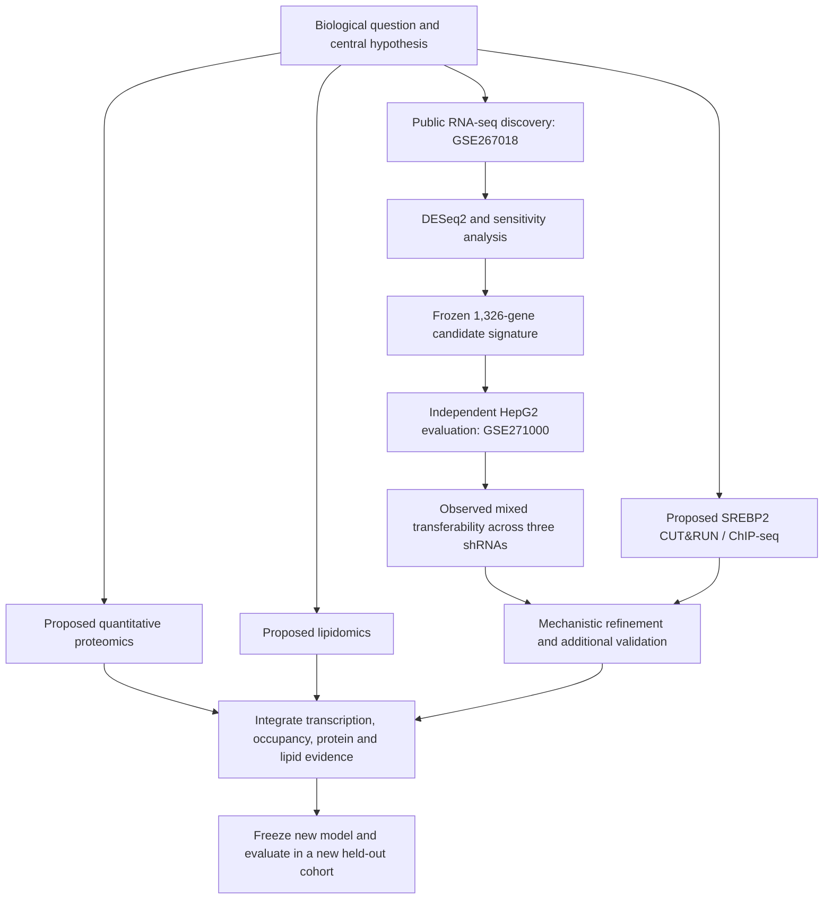

# Decoding SREBP2-Dependent Cholesterol Homeostasis Through Integrated Multi-Omics

**A reproducible SREBF2 regulatory-network research program and PhD-scale fellowship-style proposal**

[](https://github.com/mtariqi/srebf2-regulatory-signature)


**Repository:** https://github.com/mtariqi/srebf2-regulatory-signature
**Last research update:** 9 October 2026
**Project type:** Computational research with proposed experimental extensions; an educational fellowship-style research plan, **not** an awarded NIH fellowship or a completed multi-omics manuscript.

> **Evidence boundary:** HeLa discovery RNA-seq, a frozen perturbation-derived signature, and descriptive independent HepG2 validation have been completed. SREBP2 occupancy-based target classification, proteomics, lipidomics, and integrated activity-model validation remain **proposed/not completed**. The current signature is **not yet binding-supported**, and superior performance to SREBF2 RNA expression has **not** been demonstrated.

## Executive summary

**SREBF2** encodes **SREBP2**, a sterol-responsive transcription factor that coordinates cholesterol synthesis and uptake. Its transcriptional activity depends on sterol-regulated proteolytic processing and nuclear translocation, so SREBF2 messenger RNA abundance is not necessarily a direct readout of active nuclear SREBP2.

This project asks how SREBP2-dependent transcription, chromatin occupancy, protein abundance, and lipid metabolism are connected—and whether these molecular layers can improve inference of SREBP2 activity. The work currently provides a reproducible transcriptomic foundation for a broader, hypothesis-driven multi-omics research plan.

### Current evidence at a glance

| Measure | Verified result | Interpretation |
|---|---:|---|
| Discovery cohort | 12 HeLa samples, GSE267018 | WT and SREBF2 KO under FBS and cholesterol depletion |
| Discovery genes tested | 17,158 | DESeq2 analysis with GENCODE v47 annotation |
| KO vs WT, depletion | 6,387 DEGs at BH FDR < 0.05 | 3,105 increased and 3,282 decreased in KO; **no fold-change cutoff** in this count |
| KO vs WT, FBS | 4,198 DEGs at BH FDR < 0.05 | 1,914 increased and 2,284 decreased in KO |
| Genotype × treatment interaction | 62 DEGs at BH FDR < 0.05 | Complete 12-sample model |
| Frozen candidate signature | **1,326 genes** | 795 decreased in KO; 531 increased in KO |
| Validation cohort | 8 HepG2 samples, GSE271000 | Two controls and two replicates for each of three shRNAs |
| Validation ID compatibility | **1,326 / 1,326 (100%)** | Exact gene-ID matches in the 78,932-gene count matrix |
| Directional validation | **2 / 3 hairpins** | Signature decreased for shSREBP2_664 and _667, but not _665 |
| Binding-supported direct targets | **Not established** | Requires validated SREBP2 occupancy and target assignment |

## 1. Background and significance

Cholesterol is essential for cellular membranes, signaling, and steroid biosynthesis, yet its intracellular concentration must be tightly regulated. SREBP2, encoded by *SREBF2*, activates sterol-regulatory programs including cholesterol biosynthesis and uptake. SREBP2 is synthesized as a membrane-bound precursor and becomes transcriptionally active following sterol-sensitive processing and nuclear entry.

Consequently, a change in *SREBF2* RNA is not necessarily proportional to nuclear SREBP2 activity. Likewise, perturbation-responsive genes are not automatically direct transcription-factor targets: observed changes can reflect downstream pathways, compensatory regulation, cell state, and off-target effects. Integrating RNA-seq with occupancy assays and functional protein/lipid measurements can help distinguish these mechanisms.

### Knowledge gap

1. Which genes responding to SREBF2 loss also have credible evidence of SREBP2 chromatin occupancy in a matched biological context?
2. Which transcriptional changes propagate to proteins and sterol/lipid phenotypes, and which are buffered or compensated?
3. Can an independently evaluated, biologically supported multi-omics activity model capture SREBP2 regulation more consistently than *SREBF2* RNA abundance or conventional cholesterol-pathway scores?
4. How transferable are these relationships across perturbation modalities and cell lines?

**Overarching research question:** How does SREBP2 regulate cellular cholesterol homeostasis, and can integrated multi-omics analyses identify binding-supported regulatory targets and functional consequences of its activity?

## 2. Objective and central hypothesis

**Overall objective:** Map the regulatory and metabolic consequences of SREBF2 perturbation and develop a reproducible framework for inferring SREBP2-associated activity from multiple molecular layers.

**Central hypothesis:** SREBP2 controls cholesterol homeostasis through a coordinated network of binding-associated transcriptional targets whose effects propagate, in a context-dependent manner, to protein abundance and lipid metabolism; integrating these layers will provide a more biologically informative measure of SREBP2 activity than *SREBF2* transcript abundance alone.

This is a **testable hypothesis**, not an established finding. An important alternative is that cross-cell-line differences and indirect responses limit the transferability of a single activity score.

## 3. Specific aims

### Aim 1 — Define SREBP2-associated transcriptional targets

**Question:** Which genes respond to SREBF2 perturbation, and which are supported by SREBP2 occupancy?

- **Transcriptomics:** Compare WT and SREBF2 KO or knockdown using bulk RNA-seq, DESeq2, and pathway analysis.
- **Epigenomics:** Analyze SREBP2 CUT&RUN or ChIP-seq, with appropriate controls and biological replicates; call and quality-control peaks; link peaks to promoters and candidate regulatory elements.
- **Integration:** Classify genes as perturbation-responsive, binding-proximal, or supported by both evidence types. Binding proximity alone is **not proof of direct functional regulation**.

**Expected output:** An auditable SREBP2 occupancy/response map and a mechanistically prioritized candidate target set.

### Aim 2 — Determine downstream protein and lipid consequences

**Question:** Do SREBF2-dependent transcriptional changes alter cholesterol-related proteins and metabolites?

- **Proteomics:** Quantitative LC-MS/MS in matched control and perturbation conditions; protein abundance, quality-control metrics, and differential protein analysis.
- **Lipidomics:** LC-MS lipid profiling with internal standards, batch controls, and targeted free/total cholesterol quantification where feasible.
- **Integration:** Compare gene, protein, and lipid changes within cholesterol biosynthesis, uptake, trafficking, and feedback pathways.

**Expected output:** A transcript–protein–lipid response map, including concordant and discordant pathways.

### Aim 3 — Develop and independently evaluate an integrated SREBP2 activity model

**Question:** Does combining molecular layers improve activity inference beyond RNA expression alone?

- Define feature-selection, normalization, scoring, and missing-data policies **before testing in a new validation cohort**.
- Benchmark against *SREBF2* RNA abundance and prespecified cholesterol-homeostasis pathway scores.
- Evaluate across independent perturbations, cell lines, and experimental batches; report effect sizes, uncertainty, calibration, and failure cases.
- Keep the already evaluated `discovery_v1` candidate signature as a **historical frozen baseline**. Any refinement informed by the existing HepG2 results is **post-validation exploratory** and needs a further independent evaluation dataset.

**Expected output:** A reproducible model with clearly defined generalizability limits—not a presumption that integration must outperform simpler baselines.

## 4. Four complementary omics technologies

| Layer | Experimental design | Primary data produced | Representative visualization | Biological interpretation |
|---|---|---|---|---|
| **Transcriptomics** | RNA-seq, control vs SREBF2 perturbation ± sterol depletion | Raw reads, gene counts, log2 fold changes, p-values and FDR | PCA, volcano plot, expression heatmap | Transcriptional response; not direct binding by itself |
| **Epigenomics** | SREBP2 CUT&RUN or ChIP-seq with matched controls | Sequencing reads, coverage tracks, called peaks, peak-to-gene annotations | Genome-browser tracks, peak heatmap, peak-location profile | Candidate SREBP2 occupancy and regulatory proximity |
| **Proteomics** | Quantitative LC-MS/MS, matched conditions | Peptide/protein intensities, identified proteins, differential abundance | Protein volcano plot, pathway heatmap | Protein-level consequences and post-transcriptional discordance |
| **Lipidomics** | LC-MS lipid profiling and cholesterol assays | Annotated lipid species, normalized abundances, sterol concentrations | Lipid heatmap, pathway-level abundance plots | Metabolic phenotype and biochemical compensation |

**Distinction:** ATAC-seq can complement occupancy assays by assessing chromatin accessibility, but accessibility **cannot replace SREBP2-specific CUT&RUN/ChIP-seq** for identifying candidate binding sites.

### Detailed-method focus for the fellowship assignment

**Method A: RNA-seq.** The existing HeLa analysis provides preliminary data for a KO-vs-WT volcano plot and a heatmap of prespecified cholesterol genes or candidate-signature genes. Differential expression in known sterol-pathway genes would support the expected regulatory response; weak or inconsistent effects would motivate context-specific or compensatory mechanisms. A heatmap must be generated from appropriate transformed expression values and labeled by sample group; separation must be assessed rather than assumed.

**Method B: SREBP2 CUT&RUN/ChIP-seq.** Proposed genome-browser views at loci such as *HMGCR*, *LDLR*, and *SQLE* will test for occupancy, not assume peaks are present. A second plot will summarize peak distribution relative to annotated promoters, introns, and intergenic regions using a defined genomic background. Occupancy and RNA-seq response together strengthen target prioritization, while absent binding or discordant expression provides meaningful alternative outcomes.

**Figure status:** Existing RNA-seq analyses can support real figures after plotting; CUT&RUN/ChIP-seq figures remain **planned** until assay-specific peak evidence is processed and validated. Do not use simulated tracks as observed results.

## 5. Experimental design and analysis safeguards

A proposed prospective study would use matched WT/control and SREBF2-perturbed cells under sterol-replete and cholesterol-depleted conditions, with independently prepared biological replicates, randomized processing order, and appropriate negative controls. Sample sizes should be finalized by a feasibility/power analysis rather than inferred from the small public cohorts.

- **RNA-seq:** Record library preparation, layout, strandness, alignment/counting QC, model design, covariates, and multiple-testing procedure.
- **CUT&RUN/ChIP-seq:** Require antibody specificity, assay controls, reproducible enrichment, and peak-level QC. Harmonize hg19/hg38 coordinates when combining public binding resources; a BigWig coverage track alone is not a called peak set.
- **Proteomics:** Use appropriate internal QC, missingness assessment, normalization, and multiple-testing correction.
- **Lipidomics:** Include internal standards, blanks, pooled QC, annotation confidence, and targeted sterol confirmation.
- **Cross-omics:** Document identifier mappings, batch effects, sample matching, model fitting, and held-out evaluation. Treat candidate targets and functional consequences as separate evidence classes.

## 6. Completed preliminary research

### 6.1 Discovery: GSE267018 (HeLa)

- **Design:** 12 samples in a 2 × 2 genotype-by-treatment design (WT vs KO; FBS vs cholesterol depletion), three samples per condition.
- **Reference:** GRCh38 and GENCODE v47; 17,158 analyzed genes.
- **Analysis:** DESeq2, with primary KO-vs-WT contrasts under depletion and FBS plus genotype-by-treatment interaction.
- **Sensitivity:** Refit excluding `SRR28966285`, retaining a documented comparison with the complete model.

| Contrast | BH FDR < 0.05 | Up in KO | Down in KO |
|---|---:|---:|---:|
| KO vs WT, depletion | 6,387 | 3,105 | 3,282 |
| KO vs WT, FBS | 4,198 | 1,914 | 2,284 |
| Genotype × treatment interaction | 62 | 0 | 62 |
| KO vs WT, depletion, sensitivity | 6,835 | 3,196 | 3,639 |
| KO vs WT, FBS, sensitivity | 4,671 | 2,147 | 2,524 |
| Interaction, sensitivity | 175 | 28 | 147 |

The change in interaction findings following sample exclusion warrants further investigation; it is not evidence that either model is automatically preferable.

### 6.2 Frozen candidate signature: `discovery_v1`

**Selection rules:** Primary depletion contrast BH-adjusted p-value < 0.05 and absolute log2 fold change ≥ 1; same nonzero direction in FBS and the sample-exclusion sensitivity contrast; exact-match gene annotation; exclude *SREBF2* itself. FBS and sensitivity contrasts did **not** require statistical significance.

| Component | Genes | Operational definition |
|---|---:|---|
| Positive | **795** | Expression decreases following SREBF2 KO |
| Negative | **531** | Expression increases following SREBF2 KO |
| **Total** | **1,326** | Frozen perturbation-derived candidate signature |

The complete gene-selection audit, input hashes, output hashes, and manifest are recorded in `results/signature/discovery_v1/`. **Binding support has not yet been established.**

### 6.3 Independent validation: GSE271000 (HepG2)

- **Samples:** Eight (two controls; two each for shSREBP2_664, shSREBP2_665, and shSREBP2_667).
- **Counts:** 78,932 genes; exact matches for all 1,326 signature genes.
- **Scoring:** Frozen direction-aware expression-percentile score after median-of-ratios normalization; the policy was frozen before validation scoring.
- **Policy SHA-256:** `e1cb502b1076550ee1b36a968295e1bb9293295bfc11bfda3e809206cc04f72c`.

| Condition | n | Mean signature score | Δ score vs control | Mean SREBF2 log2-normalized count | Δ SREBF2 vs control |
|---|---:|---:|---:|---:|---:|
| Control | 2 | 0.098951 | 0 | 12.139353 | 0 |
| shSREBP2_664 | 2 | 0.089487 | −0.009463 | 10.459153 | −1.680200 |
| shSREBP2_665 | 2 | 0.099560 | +0.000609 | 10.884256 | −1.255098 |
| shSREBP2_667 | 2 | 0.088513 | −0.010438 | 9.664938 | −2.474415 |

**Interpretation:** SREBF2 RNA abundance was lower in all three knockdown groups; the candidate signature moved in the expected direction in two groups, but not shSREBP2_665. These are **descriptive** comparisons with only two samples per group. The data do **not** establish superior predictive performance, specificity, or a causal explanation for the discordant hairpin.

**QC note:** The two control libraries were reported as single-end but observed as paired-end; the counting workflow recorded paired-end, unstranded processing. This discrepancy should remain documented in the validation audit.

### 6.4 Preliminary research conclusion

The completed work demonstrates a reproducible perturbation-derived candidate signature and a technically compatible cross-cell-line scoring workflow. The mixed HepG2 response motivates mechanistic target refinement, careful treatment of low-expression genes, and testing in additional independent cohorts. It does **not** yet establish a validated direct-target network or a multi-omics activity score.

## 7. Proposed binding-evidence resources

Public metadata audits have identified potential occupancy datasets, including HeLa SREBP2 ChIP-seq (`GSE282800`) and HepG2 SREBP2 CUT&RUN (`GSE271001`). Their suitability for target assignment requires confirmation of matched controls, assay quality, genome assembly, and peak-calling strategy. HeLa H3K27ac (`GSE267019`) measures an active chromatin mark, **not** SREBP2 binding. No peak-based target classifications are reported as completed here.

## 8. Research workflow



**Completed:** RNA-seq discovery → signature freeze → first independent HepG2 evaluation.
**Proposed:** Binding integration, protein/lipid experiments, multi-omics model development, and additional held-out validation.

## 9. Repository navigation and reproducibility

The following paths are **confirmed from completed local commands or recorded analysis outputs**. This is a guide to the existing research workflow, not a claim that all proposed multi-omics folders have been created.

```text
srebf2-regulatory-signature/
├── README.md
├── metadata/
│   ├── GSE271000_validation_samples.tsv
│   ├── SREBF2_VALIDATION_SCORING_POLICY_v1.json
│   ├── GSE282800_binding_audit.txt
│   └── GSE271001_binding_audit.txt
├── scripts/
│   ├── srebf2_differential_expression.R
│   ├── srebf2_build_signature_v1.py
│   └── srebf2_validation_score_v1.py
└── results/
    ├── de/discovery_v1/
    │   ├── DE_SUMMARY.tsv
    │   └── annotated/
    ├── counts/validation/GSE271000/
    │   └── GSE271000_validation_gene_counts.tsv
    ├── signature/discovery_v1/
    │   ├── SREBF2_SIGNATURE_ALL.tsv
    │   ├── SREBF2_SIGNATURE_POSITIVE.tsv
    │   ├── SREBF2_SIGNATURE_NEGATIVE.tsv
    │   ├── SIGNATURE_SELECTION_AUDIT.tsv
    │   └── SIGNATURE_MANIFEST.json
    └── signature_validation/GSE271000_v1/
        ├── SAMPLE_SCORES.tsv
        ├── GROUP_SUMMARY.tsv
        └── RUN_MANIFEST.json
```

### Reproduce existing analyses

From the repository root, with the appropriate R/Python environments and source data available:

```bash
# Inspect the existing discovery outputs; do not overwrite them
cat results/de/discovery_v1/DE_SUMMARY.tsv

# Inspect the frozen discovery signature and its selection audit
cat results/signature/discovery_v1/SIGNATURE_MANIFEST.json

# Inspect the frozen scoring policy and independent validation results
cat metadata/SREBF2_VALIDATION_SCORING_POLICY_v1.json
cat results/signature_validation/GSE271000_v1/GROUP_SUMMARY.tsv
cat results/signature_validation/GSE271000_v1/RUN_MANIFEST.json
```

**Reproducibility policy:** Keep the original discovery signature and scoring policy unchanged. Their hashes record the exact evaluated versions. Avoid re-running scripts that refuse overwriting frozen outputs; use a new versioned directory for future analyses. Keep raw sequencing reads and large intermediate alignment files out of Git unless explicitly managed using an appropriate large-data system.

## 10. Research progress and next milestones

| Work package | Status as of 2026-10-09 | Next action |
|---|---|---|
| Research question and hypothesis | **Completed for current proposal** | Refine with instructor feedback |
| Reference preparation and RNA-seq pipeline | **Completed for analyzed cohorts** | Preserve QC records |
| HeLa discovery differential expression | **Completed** | Biological/pathway interpretation |
| Outlier-exclusion sensitivity analysis | **Completed** | Investigate interaction sensitivity |
| Frozen `discovery_v1` signature | **Completed** | Preserve unchanged |
| Exact-ID validation compatibility | **Completed** | No remapping needed |
| HepG2 rank-based signature scoring | **Completed** | Quantify robustness and uncertainty |
| SREBP2 occupancy integration | **Not yet completed** | Validate assays and call/assess peaks |
| Proteomics | **Proposed** | Design matched LC-MS/MS experiment |
| Lipidomics | **Proposed** | Design LC-MS profiling and cholesterol assays |
| Integrated multi-omics activity model | **Proposed** | Define features and freeze new evaluation plan |
| Additional held-out validation | **Proposed** | Identify independent suitable cohort |
| Fellowship-style proposal figures | **In preparation** | Use real RNA-seq results; label proposed assays |

### Immediate next steps

1. Audit SREBP2 occupancy data and controls; obtain trustworthy peaks and harmonize genome coordinates.
2. Examine the shSREBP2_665 discrepancy without removing it from the primary analysis; assess low-expression sensitivity and component-wise scores.
3. Annotate candidate genes as binding-proximal or unsupported using explicit peak-to-gene rules, without overstating directness.
4. Develop feasible matched proteomic and lipidomic experiments with replicates, quality controls, and measurable outcomes.
5. Predefine a new integrated-model evaluation protocol and test it in **additional** independent data, because the first HepG2 validation results have already been observed.

## 11. Expected outcomes, alternative interpretations, and limitations

| Hypothesis-linked expectation | Supporting result | Alternative or potentially falsifying result |
|---|---|---|
| SREBP2 regulates cholesterol-related transcripts | Coherent changes in prespecified cholesterol genes after perturbation | Weak or context-dependent transcript changes |
| A subset of responsive genes is occupancy-supported | Reproducible SREBP2 peaks near responsive loci | Few reproducible peaks, or binding without expression response |
| Transcriptional changes affect metabolic output | Concordant protein and lipid shifts | Compensation, delayed effects, or discordant molecular layers |
| Integrated models add useful information | Better held-out discrimination/calibration than simple baselines | No improvement, instability, or loss of transferability |

**Limitations:** The completed discovery and validation use different cell lines and perturbation modalities; the independent validation has only two samples per group; SREBF2 RNA is an imperfect proxy for active SREBP2 protein; a broad signature may include indirect and nonspecific responses; and the current results do not include measured SREBP2 occupancy, proteins, or lipids. These limitations shape the proposed experiments rather than invalidate the preliminary analysis.

## 12. Deliverables for the fellowship-style assignment

- **Problem statement and knowledge gap:** Sections 1–2.
- **Testable central hypothesis and three specific aims:** Sections 2–3.
- **Four omics methods, data types, and biological interpretation:** Section 4.
- **Two methods in depth:** RNA-seq and SREBP2 CUT&RUN/ChIP-seq, with planned figures and alternative outcomes in Section 4.
- **Preliminary research evidence:** Section 6; completed computational findings clearly distinguished from proposed experiments.
- **Feasibility, reproducibility, expected outcomes, and limitations:** Sections 5, 9–11.

This README supports a **fellowship-style educational proposal**; it is not itself an NIH submission, evidence of funded work, or a claim that all four omics assays have been completed.

## 13. Project stewardship

**Research repository:** [mtariqi/srebf2-regulatory-signature](https://github.com/mtariqi/srebf2-regulatory-signature)
**Researcher:** Md. Tariqul Islam
**Program:** MSc Bioinformatics, Northeastern University

For reuse, cite the original GEO accessions and any assay-specific source publications in the final report. Full bibliographic references, software versions, and experimental provenance should be added as those sources are formally verified.
